# LLD UML Diagrams - Event Manager System

## 1. Class Diagram - Complete Data Model

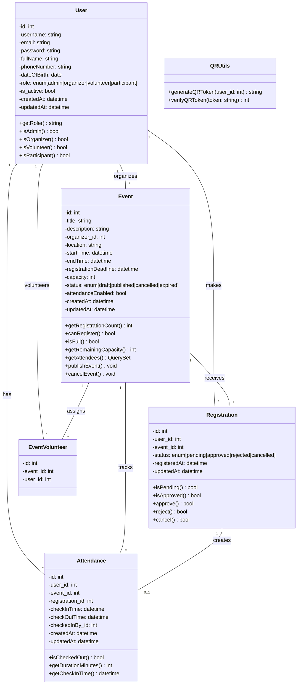

## 2. Class Diagram - Accounts Module

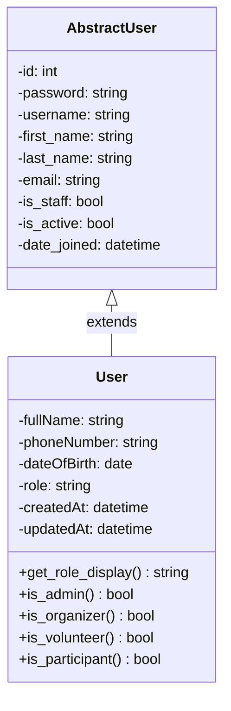

## 3. Class Diagram - Events Module

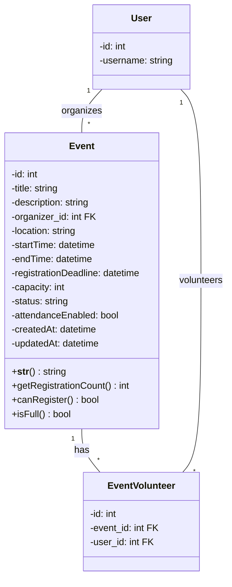

## 4. Class Diagram - Registrations Module

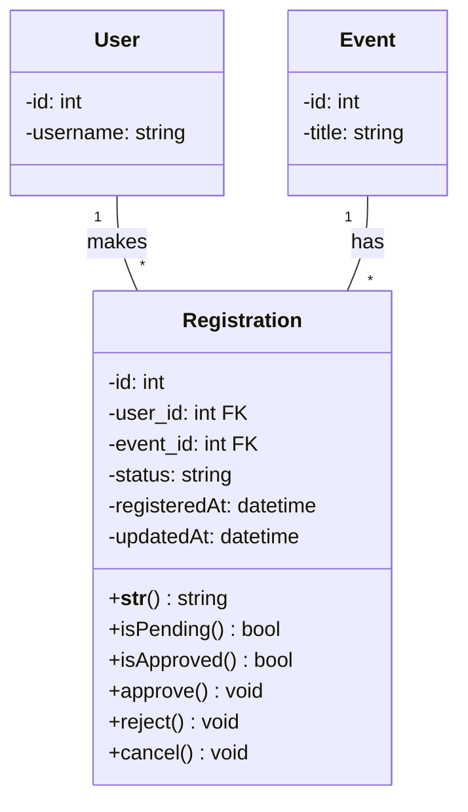

## 5. Class Diagram - Attendance Module

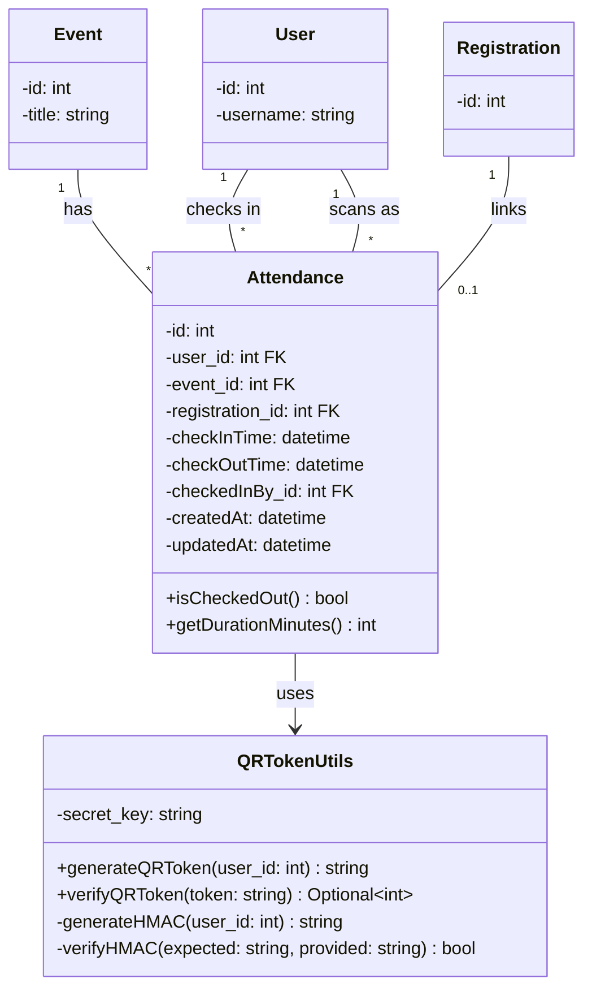

## 6. Sequence Diagram - User Registration & Event Attendance

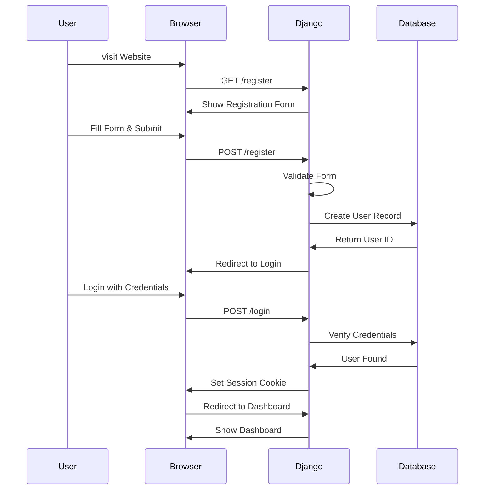

## 7. Sequence Diagram - Event Registration Process

```mermaid
sequenceDiagram
    participant Participant
    participant App as Event App
    participant Organizer as Organizer
    participant DB as Database
    
    Participant->>App: Browse Events
    App->>DB: Query Published Events
    DB->>App: Return Event List
    App->>Participant: Show Events
    Participant->>App: Click Register
    App->>DB: Check Capacity
    DB->>App: Return Capacity Status
    alt Event Full
        App->>Participant: Show Error: Event Full
    else Capacity Available
        Participant->>App: Confirm Registration
        App->>DB: Create Registration Record
        DB->>App: Success
        App->>Organizer: Notify New Registration
        App->>Participant: Show Pending Status
        Organizer->>App: Review Registrations
        Organizer->>App: Approve Registration
        App->>DB: Update Status to Approved
        DB->>App: Success
        App->>Participant: Send Approval Notification
        Participant->>Participant: Can Now Attend Event
    end
```

## 8. Sequence Diagram - QR Code Check-in Process

```mermaid
sequenceDiagram
    participant Participant
    participant Volunteer
        EventUser->>App
    participant QR as QR Utils
    participant DB as Database
    
    Participant->>App: Receive QR Code
    Participant->>Volunteer: Arrive at Event
    Volunteer->>App: Open QR Scanner
    Participant->>App: Show QR Code
    App->>App: Scan QR Code
    App->>QR: verify_qr_token(token)
    QR->>QR: Parse Token: user_id:signature
    QR->>QR: Regenerate HMAC Signature
    QR->>QR: Compare Signatures
    alt Valid Token
        QR->>App: Return user_id
        App->>DB: Create Attendance Record
        DB->>DB: Set checkInTime = NOW()
        DB->>DB: Set checkedInBy = Volunteer
        DB->>App: Success
        App->>Volunteer: Check-in Successful
        Volunteer->>Participant: Welcome to Event!
    else Invalid Token
        QR->>App: Return None
        App->>Volunteer: Invalid QR Code
        Volunteer->>Participant: Please Try Again
    end
```

## 9. Entity Relationship Diagram (ERD)

```mermaid
erDiagram
    USER ||--o{ EVENT : organizes
    USER ||--o{ REGISTRATION : makes
    USER ||--o{ ATTENDANCE : has
    USER ||--o{ EVENT_VOLUNTEERS : "as volunteer"
    USER ||--o{ ATTENDANCE : scans_as
    EVENT ||--o{ REGISTRATION : receives
    EVENT ||--o{ ATTENDANCE : tracks
    EVENT ||--o{ EVENT_VOLUNTEERS : assigns
    REGISTRATION ||--o| ATTENDANCE : creates
    
    USER {
        int id PK
        string username UK
        string email
        string password
        string fullName
        string phoneNumber
        date dateOfBirth
        string role
        bool is_active
        datetime date_joined
        datetime createdAt
        datetime updatedAt
    }
    
    EVENT {
        int id PK
        string title
        text description
        int organizer_id FK
        string location
        datetime startTime
        datetime endTime
        datetime registrationDeadline
        int capacity
        string status
        bool attendanceEnabled
        datetime createdAt
        datetime updatedAt
            participant EventUser
    
    REGISTRATION {
        int id PK
        int user_id FK
            EventUser->>App: Browse Events
            App->>DB: Query Published Events
            DB->>App: Return Event List
            App->>EventUser: Show Events
            EventUser->>App: Click Register
            App->>DB: Check Capacity
            DB->>App: Return Capacity Status
            alt Event Full
                App->>EventUser: Show Error: Event Full
            else Capacity Available
                EventUser->>App: Confirm Registration
                App->>DB: Create Registration Record
                DB->>App: Success
                App->>Organizer: Notify New Registration
                App->>EventUser: Show Pending Status
                Organizer->>App: Review Registrations
                Organizer->>App: Approve Registration
                App->>DB: Update Status to Approved
                DB->>App: Success
                App->>EventUser: Send Approval Notification
                EventUser->>EventUser: Can Now Attend Event
        int user_id FK
    }
```
## 10. State Diagram - Event Lifecycle
        ## 8. Sequence Diagram - QR Code Check-in Process

        ```mermaid
        sequenceDiagram
            participant EventUser
            participant Volunteer
            participant App as Event App
            participant QR as QR Utils
            participant DB as Database
    
            EventUser->>App: Receive QR Code
            EventUser->>Volunteer: Arrive at Event
            Volunteer->>App: Open QR Scanner
            EventUser->>App: Show QR Code
            App->>App: Scan QR Code
            App->>QR: verify_qr_token method
            QR->>QR: Parse Token
            QR->>QR: Regenerate HMAC Signature
            QR->>QR: Compare Signatures
            alt Valid Token
                QR->>App: Return user_id
                App->>DB: Create Attendance Record
                DB->>DB: Set checkInTime
                DB->>DB: Set checkedInBy
                DB->>App: Success
                App->>Volunteer: Check-in Successful
                Volunteer->>EventUser: Welcome to Event!
            else Invalid Token
                QR->>App: Return None
                App->>Volunteer: Invalid QR Code
                Volunteer->>EventUser: Please Try Again
    
    note right of Expired
        Event date has passed.
        No more registrations.
        Attendance finalized.
    end note
```

## 11. State Diagram - Registration Lifecycle

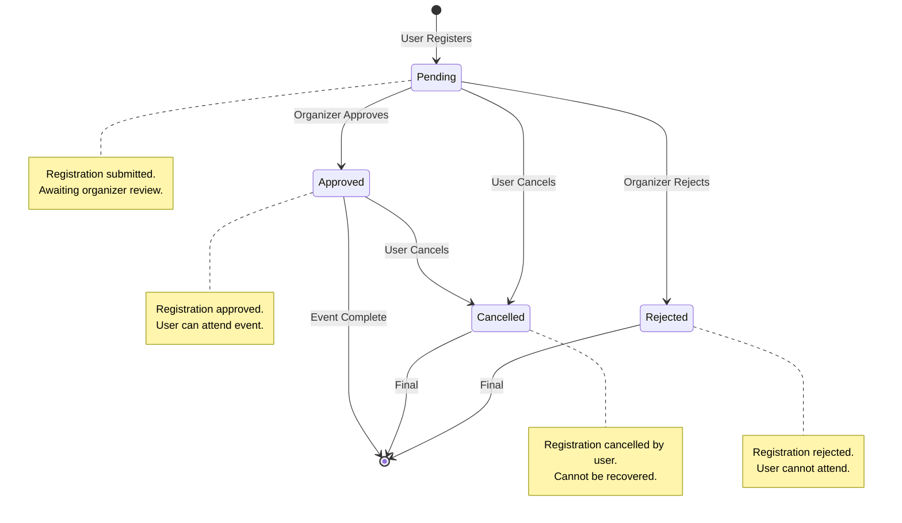

## 12. State Diagram - Attendance Status

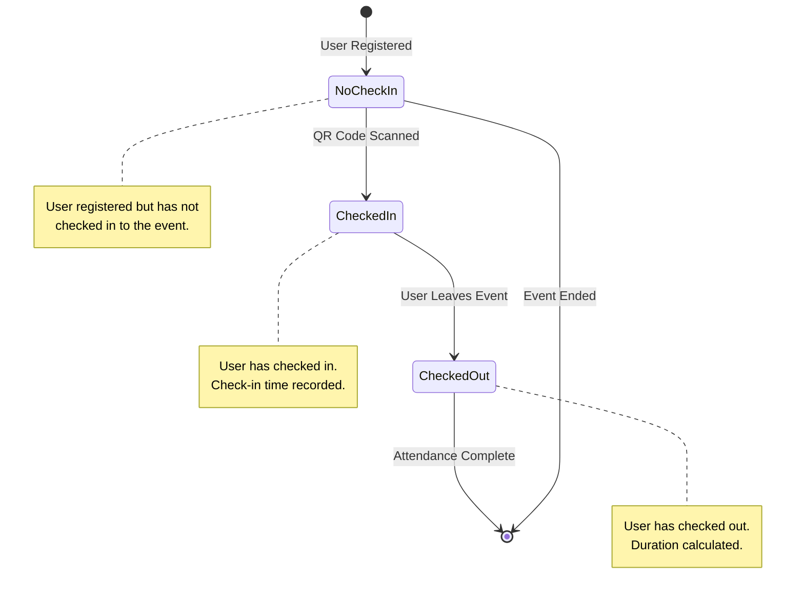

## 13. Component Diagram - System Architecture

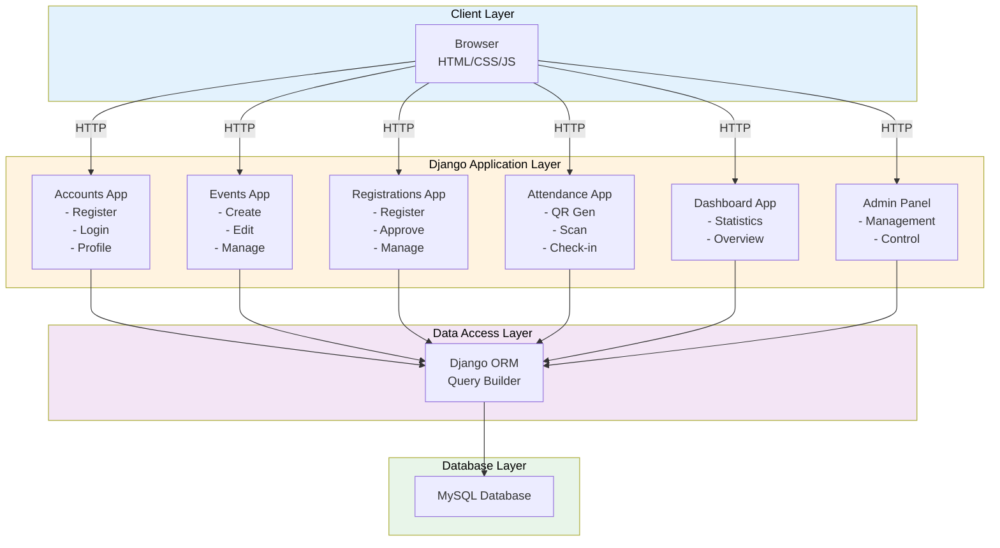

## 14. Use Case Diagram - Admin

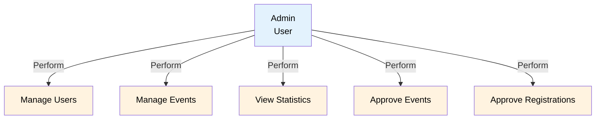

## 15. Use Case Diagram - Organizer

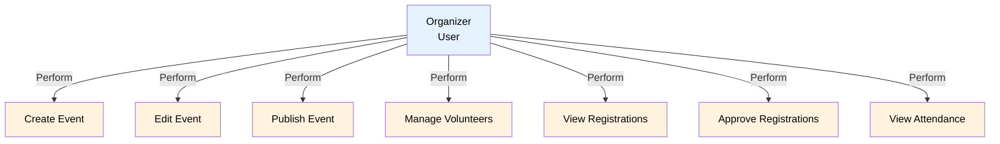

## 16. Use Case Diagram - Volunteer

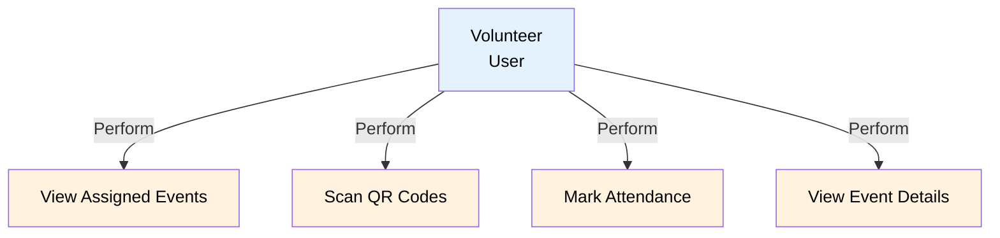

## 17. Use Case Diagram - Participant

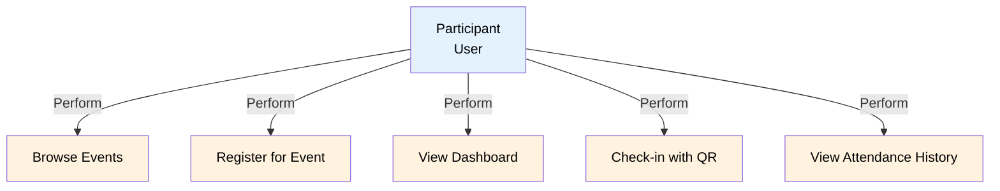

## 18. Activity Diagram - Event Registration Workflow

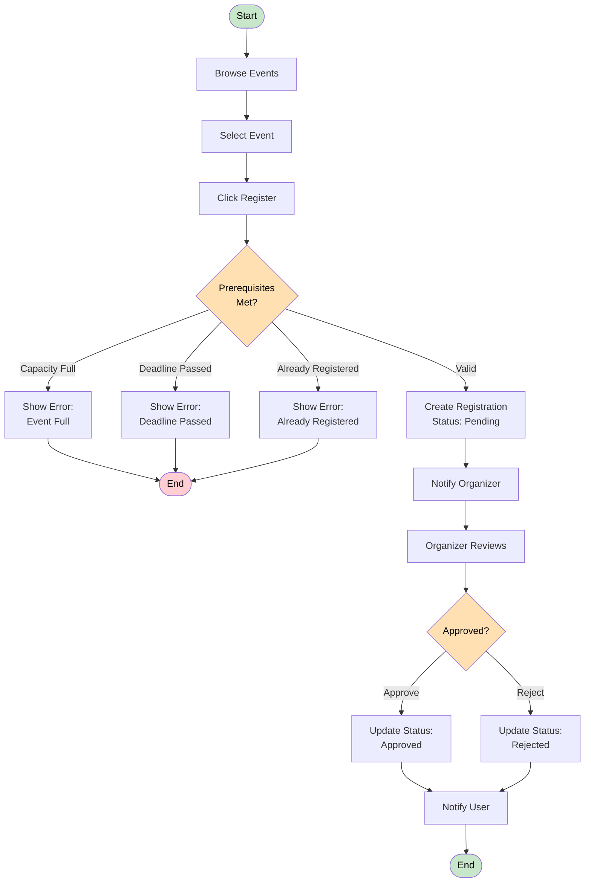

## 19. Deployment Diagram

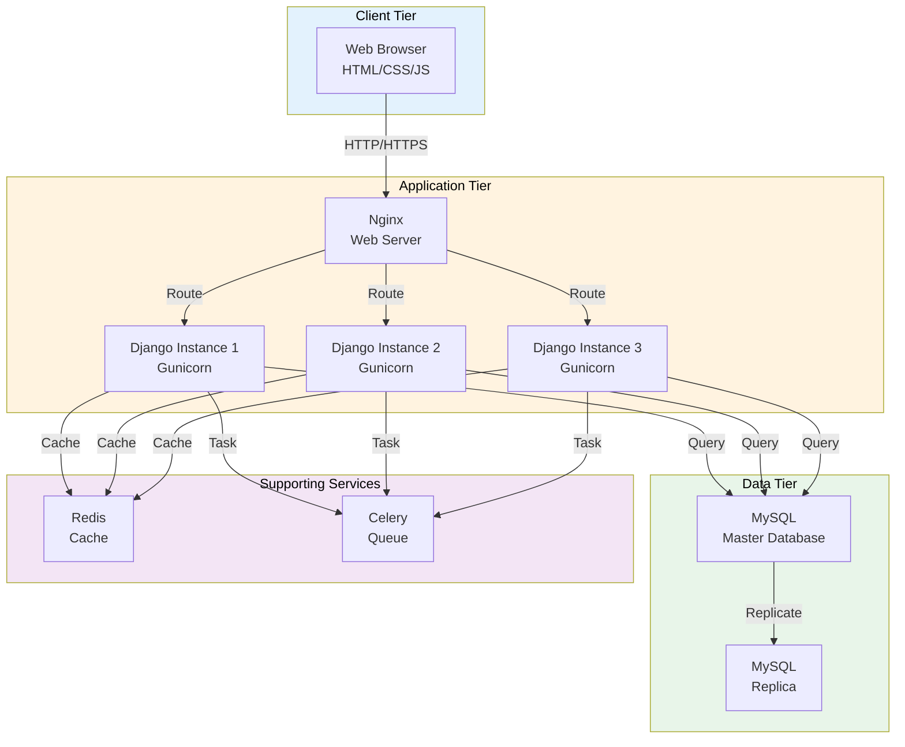

## 20. Package Diagram

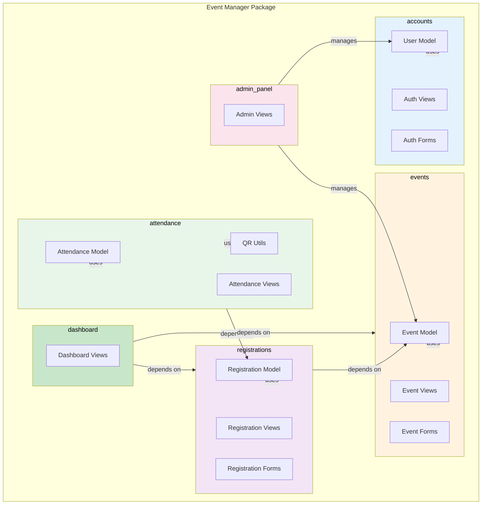

## 21. Interaction Overview Diagram - Event Registration

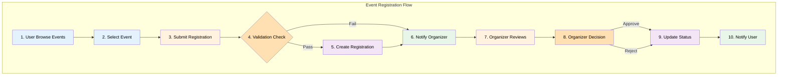
