# LLD Flow Diagrams - Event Manager System

## 1. System Data Flow Architecture

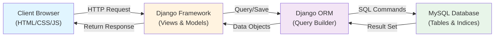

## 2. User Authentication & Registration Flow

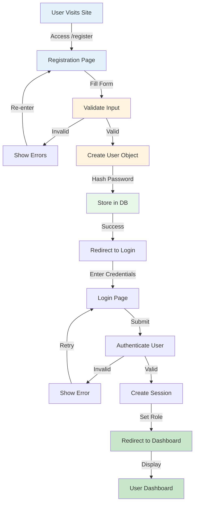

## 3. Event Creation & Management Workflow

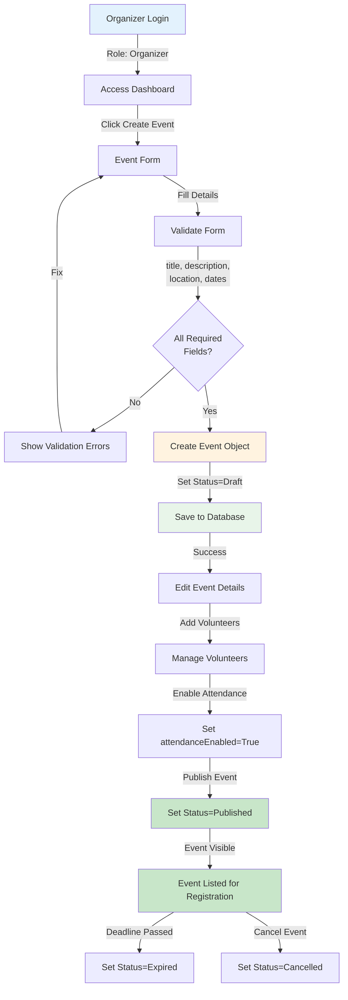

## 4. Event Registration & Approval Flow

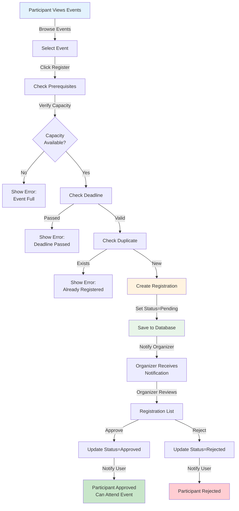

## 5. QR Code Generation & Attendance Tracking Flow

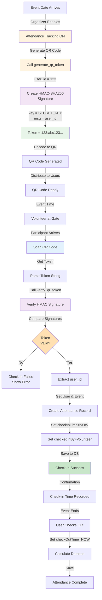

## 6. Database Query Flow - Event Registration

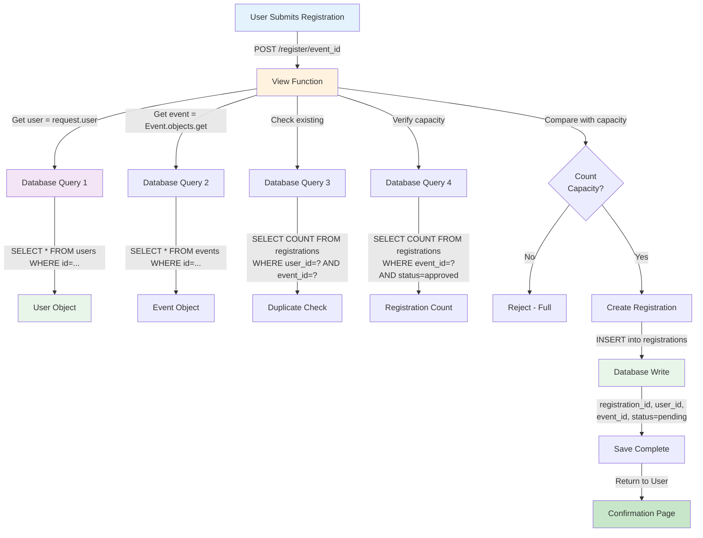

## 7. Role-Based Access Control Flow

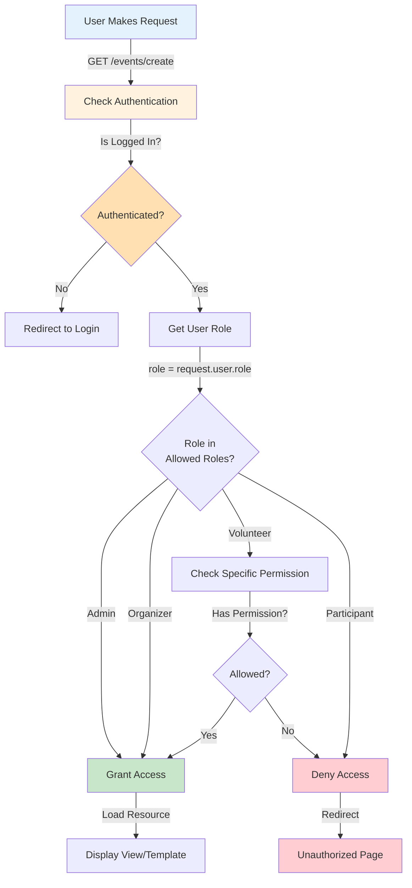

## 8. Complete Event Lifecycle Flow

```mermaid
graph LR
    A["Event Created<br/>Status: Draft"] -->|Organizer Configures| B["Event Details Set"]
    B -->|Add Volunteers| C["Volunteers Assigned"]
    C -->|Publish| D["Status: Published"]
    D -->|Registrations Open| E["Users Register"]
    E -->|Organizer Approves| F["Registration Approved"]
    F -->|Check-in Enabled| G["Attendance Ready"]
    G -->|Event Date| H["Check-ins Recorded"]
    H -->|Event Time| I["Status: Expired"]
    I -->|View Reports| J["Attendance Summary"]
    
    D -->|Cancel Before| K["Status: Cancelled"]
    K -->|Notify Users| L["Event Cancelled"]
    
    style A fill:#fff3e0
    style D fill:#c8e6c9
    style E fill:#e3f2fd
    style H fill:#c8e6c9
    style I fill:#fff9c4
    style K fill:#ffcdd2
```

## 9. Attendance Check-in Process Flow

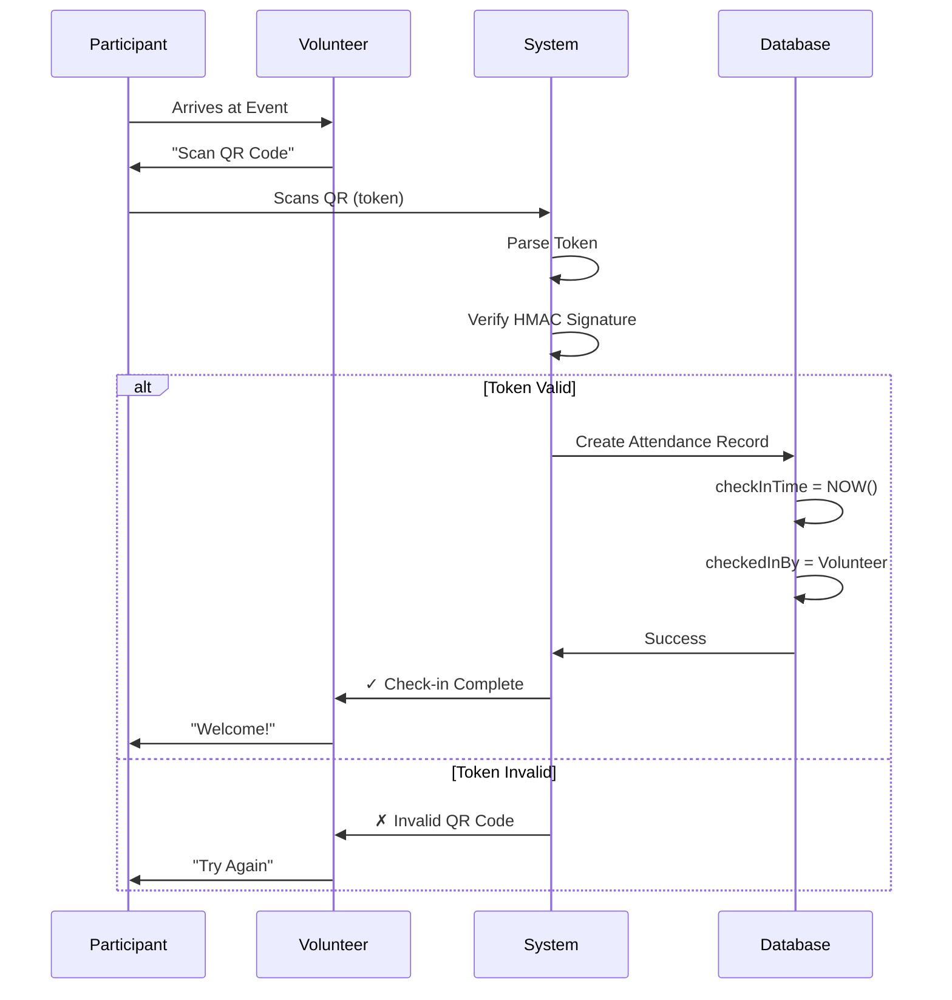

## 10. Data Relationships & Constraints

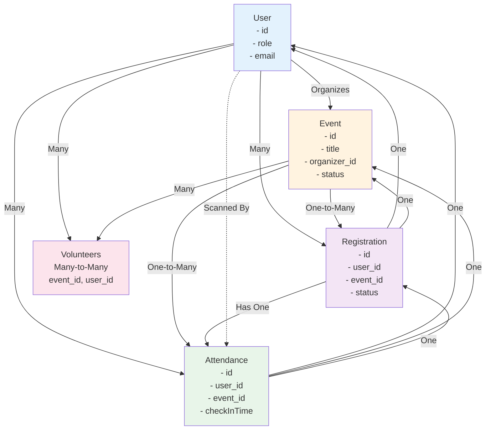

## 11. Module Interaction Flow

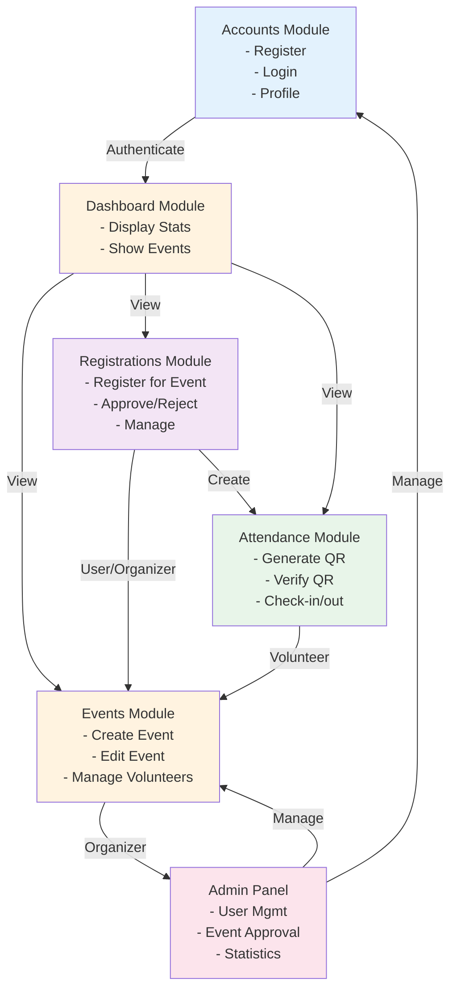

## 12. Request-Response Cycle

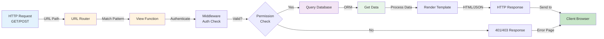

## 13. Error Handling Flow

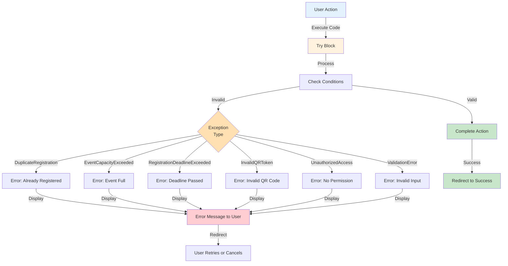

## 14. Database Write Operations Flow

```mermaid
graph TD
    A["User Submits Form"] -->|Validated Data| B["Create Model Instance"]
    B -->|user = User(...)|  C["In-Memory Object"]
    C -->|Call save()| D["Pre-save Signal"]
    D -->|Validation| E{"All Valid?"}
    E -->|No| F["Raise ValidationError"]
    F -->|Display to User| G["Show Errors"]
    E -->|Yes| H["Generate SQL"]
    H -->|INSERT/UPDATE| I["Django ORM"]
    I -->|Transaction| J["MySQL Database"]
    J -->|Lock Table| K["Write Data"]
    K -->|Commit| L["Auto-increment ID"]
    L -->|Release Lock| M["Post-save Signal"]
    M -->|Update In-Memory| N["Success Response"]
    N -->|Redirect| O["Confirmation Page"]
    
    style A fill:#e3f2fd
    style B fill:#fff3e0
    style H fill:#f3e5f5
    style J fill:#e8f5e9
    style N fill:#c8e6c9
```

## 15. QR Token Generation & Verification Algorithm Flow

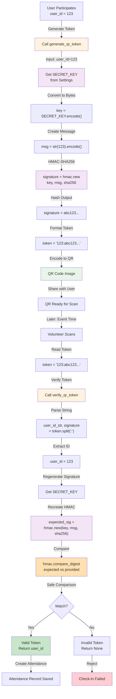

## 16. Complete User Journey - End-to-End

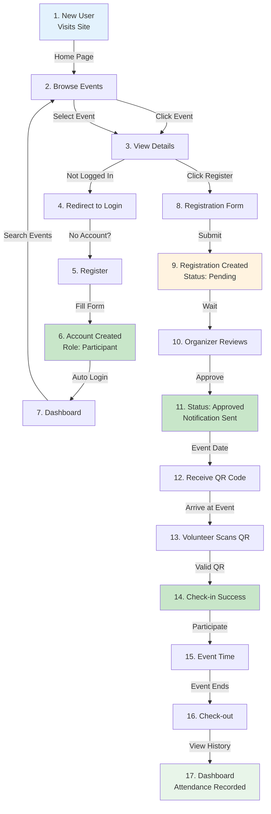
